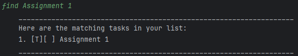
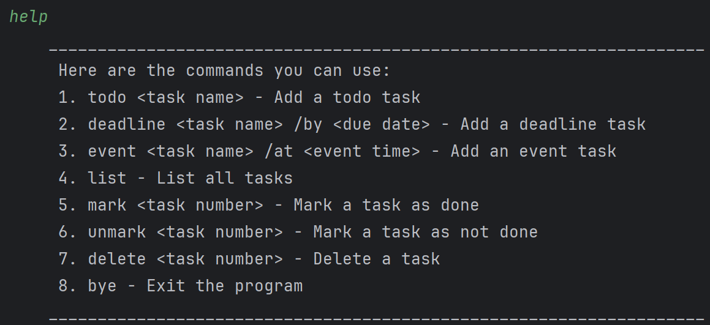

# Terry the Trusty Task Tracker User Guide

Terry the Trusty Task Tracker is a CLI-based desktop app for tracking tasks which helps users remember all the tasks they need to get done.

## Table of Contents
* [Quick start](#quick-start)
* [Features](#features)
  * [Adding Tasks: `todo` / `deadline` / `event`](#adding-tasks-todo--deadline--event)
  * [Listing all tasks: `list`](#listing-all-tasks-list)
  * [Mark/Unmark Tasks: `mark` / `unmark`](#markunmark-tasks-mark--unmark)
  * [Finding Tasks: `find KEYWORD`](#finding-tasks-find-keyword)
  * [Deleting Tasks: `delete INDEX`](#deleting-tasks-delete-index)
  * [Exiting the app: `bye`](#exiting-the-app-bye)
  * [Help: `help`](#help-help)
* [Saving the data](#saving-the-data)
* [Editing the Data File](#editing-the-data-file)
* [Command Summary](#command-summary)

## Quick start

1. Ensure you have Java 17 or above installed in your Computer. 
You can download the latest version of Java from [here](https://www.oracle.com/java/technologies/javase-jdk11-downloads.html).

2. Download the latest .jar file from [here](https://github.com/Jasonlobo21/ip/releases/tag/A-Jar).

3. Copy the file to the folder you want to use as the home folder for your Task Tracker.

4. Open a command terminal, cd into the folder you put the jar file in, and use the java -jar tyrone.jar command to run the application. 
5. Your command terminal should show the following:

5. Type the command in the command terminal and press Enter to execute it.   
   Some example commands you can try:

    * list: List all tasks currently saved by the task tracker.

    * deadline Assignment 3 /by Monday 2359: Adds a Deadline type task marked as not done with description Assignment 3 and deadline Monday 2359 to the task tracker.

    * delete 2: Deletes the 2nd task listed in the task tracker's record of tasks.

    * bye: Exits the app.  
   
6. Refer to the Features below for details of each command.

## Features

### Adding Tasks: `todo` / `deadline` / `event`
Adds a task to the task tracker. Tasks can be of one of 3 types: a Todo, Deadline or Event. 
Upon adding the task, Terry will also show the number of tasks in the task list.

* Add Todo: `todo DESCRIPTION`   

* Add Deadline: `deadline DESCRIPTION /by DEADLINE`   

* Add Event: `event DESCRIPTION /from START /to END`   

### Listing all tasks: `list`
Displays the task tracker's task list, a list which contains all tasks currently recorded by Terry.   

### Mark/Unmark Tasks: `mark` / `unmark`
mark INDEX marks the task at specified INDEX as done, while unmark INDEX marks the task at the specified INDEX as not done. 
The index refers to the index of the task in the task list. 
When start is marked done, a 'X' will appear next to task.  
* Mark as done: `mark INDEX`   
   
* Mark as not done: `unmark INDEX`   
 

### Finding Tasks: `find KEYWORD`
Finds tasks that contain the keyword in the task description.   

### Deleting Tasks: `delete INDEX`
Deletes the task at the specified INDEX. 
The index refers to the index of the task in the task list.   

### Exiting the app: `bye`
Exits the app.   

### Help: `help`
Displays possible commands and their formats.   

## Saving the data

Terry saves in the hard disk automatically after any command that data in the task list. 
There is no need to save manually.

## Editing the Data File

Terry automatically saves your task data in a text file located at ./data/terry.txt, relative to the directory where you run the program. 
Advanced users can update their tasks by directly editing this file.

## Command Summary

| Command                  | Format & Examples                                                                                              |
|--------------------------|----------------------------------------------------------------------------------------------------------------|
| Adding Todo Task         | `todo` Description    e.g. `todo Assignment 1`                                                             |       
| Adding Deadline Task     | `deadline` Description `/by` Deadline   e.g. `deadline Quiz 3 /by Monday 2359`                             |
| Adding Event Task        | `event` Description `/from` Start `/to` End   e.g. `event CS2113 Lec /from Friday 1600 /to 1800` |
| Listing all tasks        | ` List  `                                                                                                      |
| Marking task as done     | `mark` Task_Number   e.g. `mark 1`                                                                         |
| Marking task as Not done | `unmark` Task_Number   e.g. `unmark 1`                                                                     |
| Deleting task            | `delete` Task_Number   e.g. `delete 1`                                                                     |
| Finding task             | `find` Keyword   e.g. `find Assignment`                                                                    |
| Exiting the app          | `bye`                                                                                                          |
| Help                     | `help`                                                                                                         |
